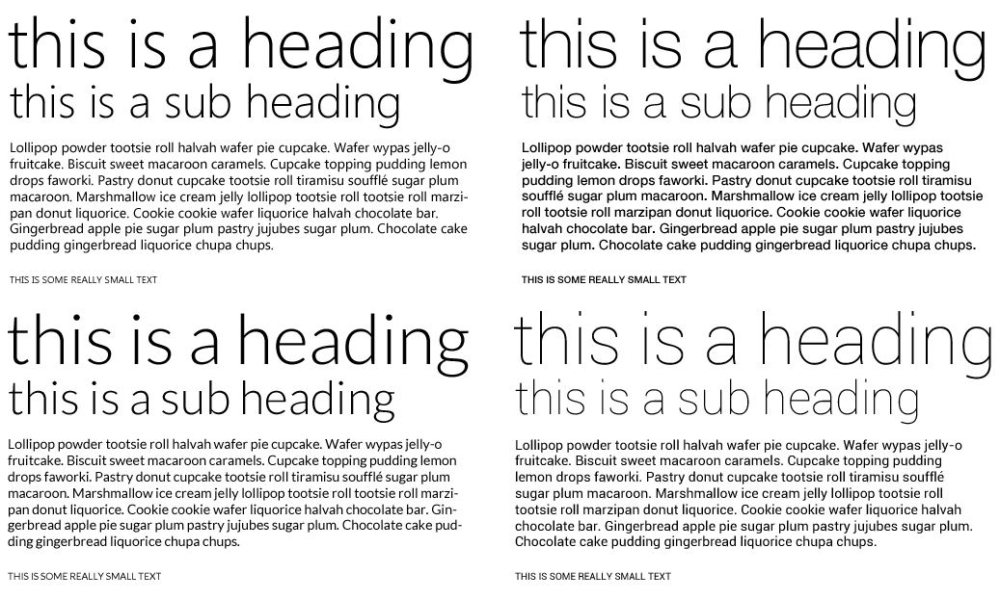

 Metro is all about clean, clear typography. Segoe UI is the most popular font for metro designs, but isn't on all platforms.  We're currently investigating a good set of similar and commonly installed fonts to create the perfect font family, taking into account licensing with Segoe UI for @font-face just isn't feasible.

`Helvetica Neue` is installed on OS X and iOS which has all the weightings and similarities (or visa-versa) to Segoe. `Roboto` is the new font from Google for Android 4 ("Ice Cream Sandwhich") and is under the Apache license, meaning it is fair play for @font-face.

`font-family: Segoe UI, Segoe WP, Helvetica Neue, Roboto, sans-serif;`
 
 From top left to bottom right, Segoe UI, Helvetica Neue, Lato and Roboto
 
 